## GCP CREATE BACKLIST ACCESS FOR CLOUD RUN

### Esta documentação contem o passo a passo para criar um Ip Externo onde voce controle o acesso externo dele usando Cloud Run + Cloud Armor

#### Este documento conterá os seguintes conteudos

> Segurança Da Rede

>> Cloud Armor + Configurações

> Cloud Run

> Endpoints de Rede

> Load Balancer for Cloud Run

## Passo para criar uma BlackList para o Cloud Run

#### 1° Criação do Servico no Cloud Run

Crie um servico no cloud run com a imagem que desejar e conclua este processo

Um ponto importante para se atentar é que na criação do serviço, precisamos coloca-lo como para apontar para serviçõs internos e Load Balancer, assim como na foto abaixo
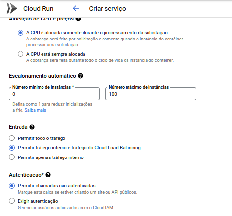

Depois de criado, guarde a url que o cloud run criará

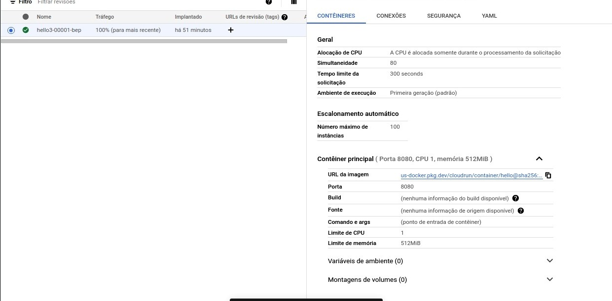

#### 2° Criando um endpoint para o servico criado no Cloud Run 

Na aba Computer Engine > Grupo de enpoints de rede, Criaremos um endpoint , ou seja, um endereço de ip externo para o nosso dns criado no cloud run.

> Criamos um ip fixo apontando para o dns , porque , é a partir dele que criaremos as regras de blacklist nos passos seguintes, entao precisamos de um endpoint que aponte para o dns criado.

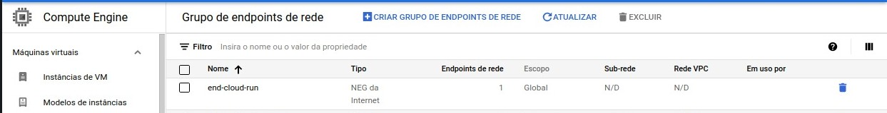

Depois de criados, ja temos a base para começarmos a criar o fluxo de bloqueio

#### 3° Criando um Balanceador de carga para usarmos o endpoint criado anteriormente

Após criarmos o endpoint que apontará para o nosso servico no cloud run, precisamos criar um balanceador de carga para abrir para o mundo externo

Estar imagens contem as configurações de backend e frontend, entao se atente nos passos em que voce se encontra e compare com as imagens abaixo para que tudo ocorra corretamente

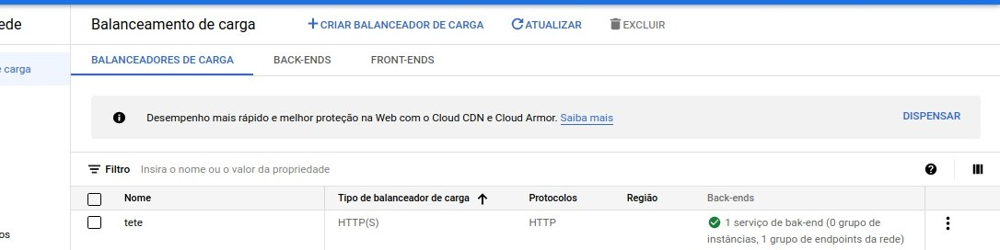

Após criado entre no load balancer criado e edite. Na aba de front-end, nao precisaremos editar nada e ele fica assim :

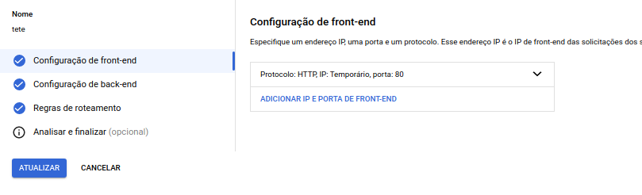

no backend teremos as seguintes configurações:

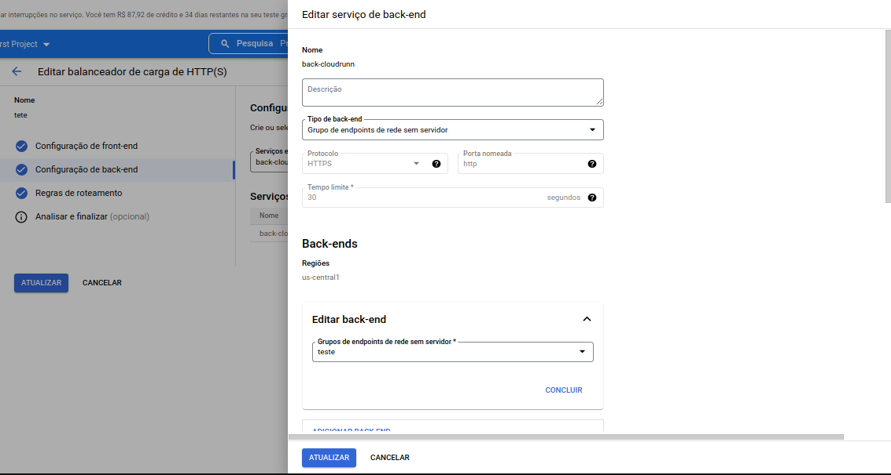

na pagina de backend-precisamso colocar o backend apontando para o cloud run, entao colocar um nome para esse backend e a regiao em que criamos o cloud run

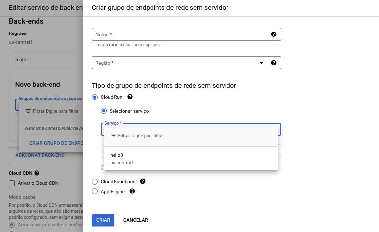

Depois de criado, role ate o final da pagina e click em CONFIGURAÇÕES AVANÇADAS. Mais abaixo teremos um pagina escrito Cabeçalhos de resposta personalizados e através desta pagina teremos que colocar o host do cloud run, como exemplo, imagem abaixo:

Depois de tudo isso criado, precisamos guarda o ip externo que será criado e criarmos finalmente o bloqueio através do Cloud Armor
Entre em seguranca de rede -> Cloud Armor -> Criar uma nova politica

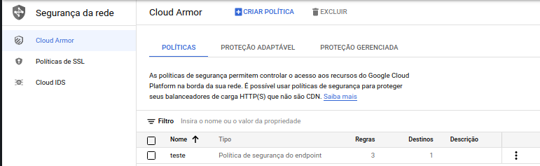

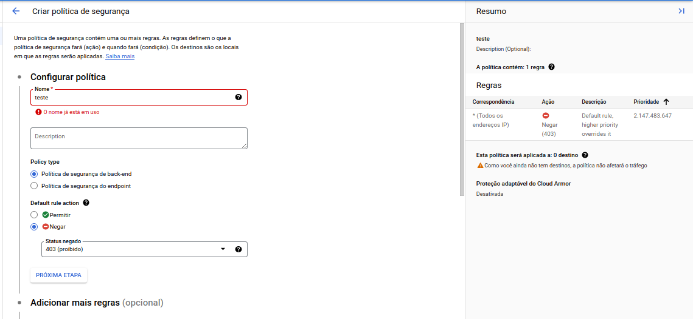

No primeiro momento, criaremos uma regra para bloquear todos os endereçõs, entao apenas daremos o nome da regra e criaremos para que ele bloqueie os ´´´ENDPOINTS´´´

Depois acessamos ela e adicionaremos uma regra que vai bloquear o ip externo do load balancer e liberar os ips que voce gostaria, se atenta na prioridade que esta descrito na foto, ela tem que ser 0, pois eh a primeira que vai ser valida.

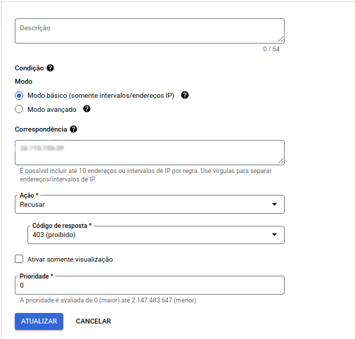

Veja que nessa imagem, a prioridade esta como 1, o que significa que o segundo mais importante é a liberação e neste caso , estamos liberando para que voce consiga acessar normalmente
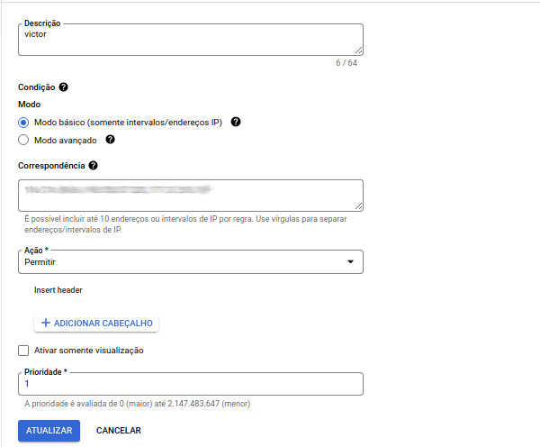